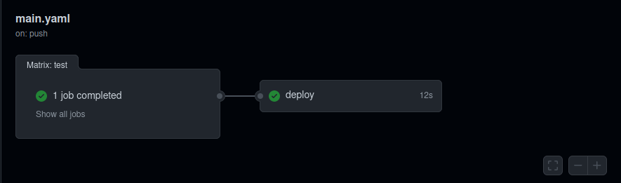
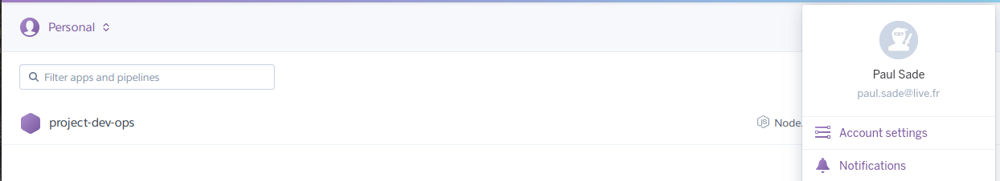

# Project
>[DevOps Assignment](https://github.com/adaltas/ece-devops-2021-fall/blob/master/PROJECT.md)

This project let us apply what we have learn since the begining of the year

## Screenshots
### CI/CD




## Instructions
### Install
- Clone repository
```sh
# https
git clone https://github.com/polocto/Project-SI.git
```
```sh
# ssh
git clone git@github.com:polocto/Project-SI.git
```
```sh
# github CLI
gh repo clone polocto/Project-SI
```
- [Install dependencies for userapi](./userapi/README.md#installation)

### Usage
- [Start userapi](./userapi/README.md#usage)
### Test
- [Test userapi](./userapi/README.md#testing)

## Platforms & Tools
- [Github Action](https://github.com/polocto/Project-SI/actions)
- [Heroku](https://dashboard.heroku.com/apps)

## Bonus

## Credits
Paul SADE & Mathis CAMARD

## License
None
