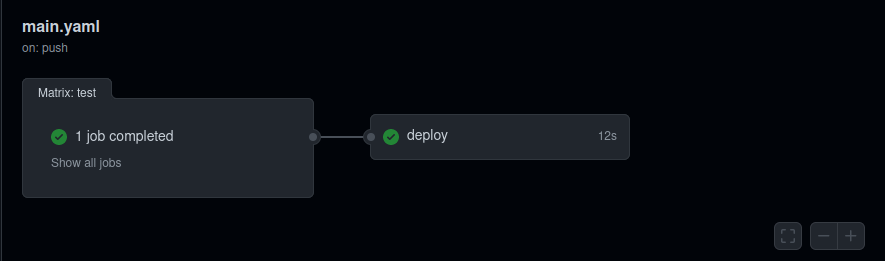
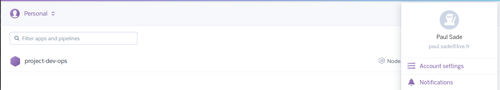

# Project

> [DevOps Assignment](https://github.com/adaltas/ece-devops-2021-fall/blob/master/PROJECT.md)

This project let us apply what we have learn since the begining of the year

## Screenshots

### CI/CD




## Instructions

### Install

- Clone repository

```sh
# https
git clone https://github.com/polocto/Project-SI.git
```

```sh
# ssh
git clone git@github.com:polocto/Project-SI.git
```

```sh
# github CLI
gh repo clone polocto/Project-SI
```

- [Install dependencies for userapi](./userapi/README.md#installation)

- [Install Vagrant](iac/README.md#prerequisite)

- [Install Docker](https://www.docker.com/get-started)

- [Install Minikube](https://minikube.sigs.k8s.io/docs/start/) for Kubernetes

- [Install istio](./istio/README.md#Installation)

-[Install Prometheus & Grafana for the monitoring](./monitoring/README.md#Installation)

### Usage

- [Start userapi](./userapi/README.md#usage)

- [Use Vagrant](iac/README.md#usage)

- Build Docker image

```sh
docker build -t projet-devops .
```

- Using Docker Compose

```sh
docker-compose up
```

Server on http://localhost:5000

- [Use a Kubernertes cluster](./k8s/README.md#usage)

- [Use Istio service meshing](./istio/README.md#Usage)

- [Use monitoring](./monitoring/README.md#Usage)

### Test

- [Test userapi](./userapi/README.md#testing)

## Platforms & Tools

- [Github Action](https://github.com/polocto/Project-SI/actions)
- [Heroku](https://dashboard.heroku.com/apps)
- [Vagrant _(centos/7)_](https://www.vagrantup.com/)
- [Docker Hub](https://hub.docker.com)
- [Kubernetes](https://kubernetes.io/)

## Deploy the application with Istio

- [Steps to deploy the app](/service_mesh/README.md)

## Bonus

## Credits

Paul SADE & Mathis CAMARD

## License

None
